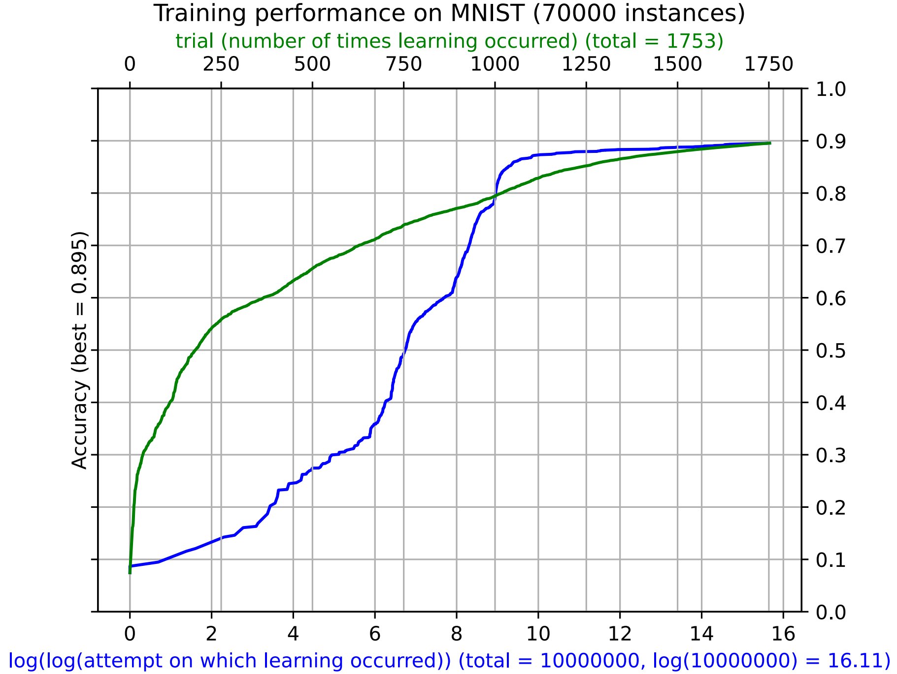

# 🧪 MNIST Hill Climbing | PyTorch ResNeXt Neural Network Optimizer

<p align="center">
  
  
  
  
</p>

**MNIST Hill Climbing is a machine learning research project implementing and evaluating hill climbing optimization with ResNeXt gating networks on the MNIST dataset.**

## 📑 Table of Contents
- [Overview](#-overview)
- [Architecture / Repository Structure](#-architecture--repository-structure)
- [Installation & Setup](#-installation--setup)
- [Usage](#-usage)
- [Issues & Support](#-issues--support)
- [Contributing](#-contributing)
- [License](#-license)

## 🚀 Overview

The first implementation of hill climbing on MNIST was done in 2017 using the SGDClassifier in scikit-learn. This was followed up with an implementation in PyTorch in 2022. In 2025, a ResNeXt gating network was added to route MNIST samples to N hill climbing experts.

The hill climbing method adds uniform noise to the weights and then runs inference on the entirety of MNIST. If the performance improved the weight increase is kept, otherwise it is disregarded and a new sample is tried. In the plot shown here accuracy of 89.5% is achieved during which time inference was run on the entirety of MNIST 10 million times.



In `mingus_hc_resnext.py` a ResNeXt network is taught to gate MNIST samples to N trained hill climbing models (with a separate mingushc implementation in `train_expert.py`) in order to test the hypothesis that the models learned with hill climbing can serve as experts. This prototype code was written by GPT-5 and Gemini Pro and it uses a sophisticated cross-validation scheme. The current best performance by this model with 37 hill climbing experts is 92.6%.

## 🏗️ Architecture / Repository Structure

The repository consists of two primary scripts:
- `mingus_hc_resnext.py`: Contains the ResNeXt gating network used to route MNIST samples to N trained hill climbing models.
- `train_expert.py`: Implements the `mingushc` algorithm to independently train the hill climbing experts.

## 💻 Installation & Setup

> [!NOTE]
> Ensure you have Python and PyTorch installed before running the project.

```bash
git clone https://github.com/mingusb/MNIST_Hill_Climbing.git
cd MNIST_Hill_Climbing
pip install torch torchvision scikit-learn
```

## 💡 Usage

Train an expert model using the hill climbing algorithm:
```bash
python train_expert.py
```

Run the ResNeXt gating network to evaluate performance:
```bash
python mingus_hc_resnext.py
```

## 🐛 Issues & Support

If you encounter any problems, please open an issue on the GitHub repository or reach out directly.

## 🤝 Contributing

Contributions are welcome! Please feel free to submit a Pull Request. For major changes, please open an issue first to discuss what you would like to change.

## 📄 License

This project is licensed under the MIT License.

Find more projects on my [GitHub Profile](https://github.com/mingusb).
